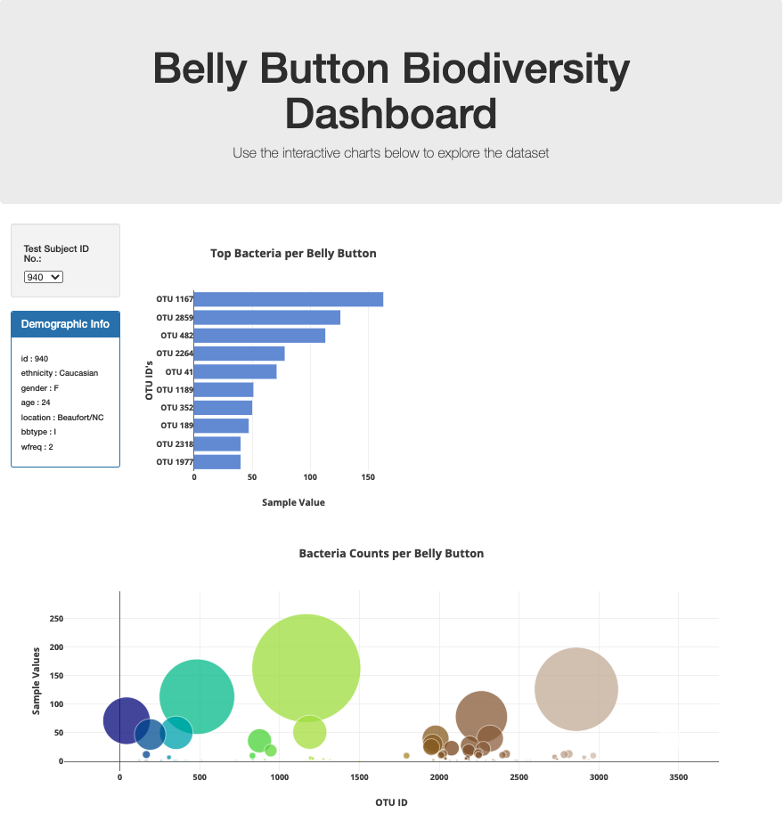

[![LinkedIn][linkedin-shield]](https://www.linkedin.com/in/john-shuford-data-analyst/)

In this challenge we were tasked with creating an interactive dash board to represent the bellybutton bacteria found inside the navels of the study participants. You can take a look at the live and interactive page [Here.](https://johnshuford.github.io/Web-Design-Challenge/)!

<!-- TABLE OF CONTENTS -->
<details open="open">
  <summary><h2 style="display: inline-block">Table of Contents</h2></summary>
  <ol>
    <li>
      <a href="#about-the-project">About The Project</a>
      <ul>
        <li><a href="#built-with">Built With</a></li>
      </ul>
    </li>
    <li>
      <a href="#getting-started">Getting Started</a>
      <ul>
        <li><a href="#prerequisites">Prerequisites</a></li>
        <li><a href="#installation">Installation</a></li>
      </ul>
    </li>
    <li><a href="#contact">Contact</a></li>
    <li><a href="#acknowledgements">Acknowledgements</a></li>
  </ol>
</details>


<!-- ABOUT THE PROJECT -->
## About The Project



In this project, I used HTML, Bootstrap, and Plotly to create an interactive dashboard that displays the bodiversity of a subjects belly button culture. The dashboad reloads for each test subject then displays the demographic information as well as a horizontal bar graph and a bubble chart.

### Built With

* [HTML5](https://developer.mozilla.org/en-US/docs/Web/Guide/HTML/HTML5)
* [Bootstrap](https://getbootstrap.com/docs/4.1/getting-started/introduction/)
* [Plotly](https://plotly.com/javascript/)

<!-- GETTING STARTED -->
## Getting Started

To get a local copy up and running follow these simple steps.

### Prerequisites

It is important to make sure that you have these files refrenced in the head of your HTML file or nothing will show when you try and run the Bootstrap elements.

CSS
  ```sh
    <link rel="stylesheet" href="https://maxcdn.bootstrapcdn.com/bootstrap/3.3.7/css/bootstrap.min.css">
  ```
  
### Installation

1. Clone the repo
   ```sh
   git clone https://github.com/JohnShuford/Plotly-Challenge.git
   ```
2. Get to editing the HTML and JS files in your favorite text editor! I recomend [Visual Studio Code](https://code.visualstudio.com/)


<!-- USAGE EXAMPLES -->
## Usage
### Plotly

Here is a code example of a function that will render a horizontal bar graph with json files that are pulled in.

```sh
function buildGraph (idNumber) {
    // filter through the samples
    d3.json('samples.json').then((data) => {
        // getting the metadata
        var sampleData = data.samples;

        // filtering metadata along the idNumber
        var filtered = sampleData.filter(d => d.id == idNumber);

        // getting the otu ids, sample values and otu labels
        var otuIds = filtered[0]['otu_ids'];
        var sampleValues = filtered[0]['sample_values']
        var otuLabels = filtered[0]['otu_labels']
        
        // Horizontal Bar Chart
        var barTrace = {
            x: sampleValues.slice(0,10).reverse(),
            y: otuIds.map(otu_ids => `OTU ${otu_ids}`).slice(0,10).reverse(),
            type: 'bar',
            orientation: "h",
            text: otuLabels.slice(0,10).reverse(),
            marker: {
              color: 'rgb(112, 148, 219)'
            }
        };

        var barData = [barTrace];

        var barLayout = {
            title: "Top Bacteria per Belly Button",
            xaxis: {title: "Sample Value"},
            yaxis: {title: "OTU ID's"}
        };

        Plotly.newPlot('bar', barData, barLayout);
    });

}
```

For more information on Plotly and examples of some more cool graphs, follow this link. https://plotly.com/javascript/#basic-charts


<!-- CONTACT -->
## Contact

John Shuford - [LinkedIn](https://www.linkedin.com/in/john-shuford-data-analyst/) - johnshuford@me.com

Project Link: [https://github.com/JohnShuford/Web-Design-Challenge](https://github.com/JohnShuford/Web-Design-Challenge)

Deployed: [https://johnshuford.github.io/Web-Design-Challenge/](https://johnshuford.github.io/Web-Design-Challenge/)

<!-- ACKNOWLEDGEMENTS -->
## Acknowledgements

* This project was completed for and under the supervision of the Trilogy team opperating the Data Analytics Bootcamp through the University of Denver.
* Shoutouts to Svitlana Malenfant (Instructor)


<!-- MARKDOWN LINKS & IMAGES -->
[linkedin-shield]: https://img.shields.io/badge/-LinkedIn-black.svg?style=for-the-badge&logo=linkedin&colorB=555
[linkedin-url]: https://www.linkedin.com/in/john-shuford-data-analyst/
